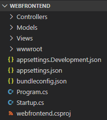

# **Workshop Azure & Containers @ ISEP**


---

## **Agenda (Azure Dev Spaces)**

1. Create a **Kubernetes-based** environment in Azure that is **optimized** for development - a **dev space**.

2. **Iteratively** develop code in containers using **VS Code** and the **command line**.

3. **Productively** develop and test **your code** in a **team environment**.

## **The Illustrated Children's Guide to Kubernetes**

[](https://youtu.be/4ht22ReBjno)

---

## [**Visual Studio Code and .NET Core with Azure Dev Spaces**](https://docs.microsoft.com/en-us/azure/dev-spaces/get-started-netcore)

### **Initial CLI Setup**

Start by [installing the Azure CLI](https://docs.microsoft.com/en-us/cli/azure/install-azure-cli?view=azure-cli-latest) and verify installation.

**Login** to your **Azure account**.

`az login`

If you have more than one subscription in your account, you can list them with the following command.

`az account list --output table`

If the subscription you desire has **_False_** value for **_IsDefault_** key.

`az account set --subscription <SUBSCRIPTION_ID>`

### **Create a Kubernetes cluster enabled for Azure Dev Spaces**

Create a **resource group** for your **Kubernetes cluster** in a [supported region](https://docs.microsoft.com/en-us/azure/dev-spaces/about#supported-regions-and-configurations)

`az group create --name "workshop-isep" --location "West Europe"`

Create an **Azure Kubernetes Service (AKS)**

`az aks create -g workshop-isep -n aks-workshop-isep --location "West Europe" --disable-rbac --generate-ssh-keys --node-count 1 --node-vm-size Standard_B2s`

### **Configure your Kubernetes Cluster to use Azure Dev Spaces**

Enter the following command to **enable Azure Dev Spaces** support in your cluster.

`az aks use-dev-spaces -g workshop-isep -n aks-workshop-isep`

### **Get Kubernetes Debugging for Visual Studio Code**

1. Install [Visual Studio Code](https://code.visualstudio.com/).

2. Install [Azure Dev Spaces extension](https://marketplace.visualstudio.com/items?itemName=azuredevspaces.azds).

### **Clone the Sample App**

**Clone** the repository with the **.NET Core** sample application to **deploy** to **Azure Dev Spaces**.

This **repository** is **forked** from the **Azure Dev Space samples** repository, and it has been **restructured to ease the deployment** process.

`git clone https://github.com/2morales/aks-workshop-isep.git`

### **Prepare the deployment**

The next step is to **containerize** it by creating **assets** that **define the app's container** and **Kubernetes deployment**.

1. Launch Visual Studio Code and open the **project folder**

   - Note that you **must** open the **dotnetcore/webfrontend** folder.
   - Ignore default prompts to add debug assets or restore the project dependencies.

2. Open the Terminal (View > Integrated Terminal).
3. Make sure you opened the __webfrontend__ folder.

<p align="center">
  
</p>

4. Run the **preparation** command (be sure to change directory into the **dotnetcore/webfrontend** folder).

   - `azds prep --public`

The following files will be generated:

- A **Dockerfile** describing the app's container image, how the source code is built and runs within the container.
- A Helm chart under **./charts/webfrontend** describing how to deploy the container to **Kubernetes**.
- A file named **azds.yaml**, containing the configuration file for Azure Dev Spaces. It complements Kubernetes artifacts with additional configuration that enables an **iterative development** experience in **Azure**.

It's worth pointing out, however, that the same **Kubernetes and Docker configuration-as-code assets** can be used from **development through to production**, thus **providing better consistency** across **different environments**.

Feel free to **explore the assets** as you'll find **different options** for configuration.

### **Build and run code in Kubernetes**

Run this command from the **root code folder**, dotnetcore/webfrontend:

`azds up`

Keep an eye on the command's output, as you'll notice several things:

- Source code is **synced** to the **dev space** in Azure.
- A **container image** is **built in Azure**, as **specified** by the **Docker assets** in your code folder.
- **Kubernetes objects** are created that utilize the **container image** as **specified** by the **Helm chart**.
- Information about the **container's endpoint(s)** is displayed.
- Assuming the above stages complete successfully, you should begin to **see stdout (and stderr)** output as the container starts up.

These steps will **take longer the first time** the up command is run, but subsequent runs should be quicker.

### **Test the application**

Scan the console output for the **_Application started_** message.

```Python
Using dev space 'default' with target 'aks-workshop-isep'
Synchronizing files...2s
Installing Helm chart...6s
Waiting for container image build...4s
Building container image...
Step 1/13 : FROM mcr.microsoft.com/dotnet/core/sdk:2.2
Step 2/13 : ARG BUILD_CONFIGURATION=Debug
Step 3/13 : ENV ASPNETCORE_ENVIRONMENT=Development
Step 4/13 : ENV ASPNETCORE_URLS=http://+:80
Step 5/13 : ENV DOTNET_USE_POLLING_FILE_WATCHER=true
Step 6/13 : EXPOSE 80
Step 7/13 : WORKDIR /src
Step 8/13 : COPY ["webfrontend.csproj", "./"]
Step 9/13 : RUN dotnet restore "webfrontend.csproj"
Step 10/13 : COPY . .
Step 11/13 : RUN dotnet build --no-restore -c $BUILD_CONFIGURATION
Step 12/13 : RUN echo "exec dotnet run --no-build --no-launch-profile -c $BUILD_CONFIGURATION -- \"\$@\"" > /entrypoint.sh
Step 13/13 : ENTRYPOINT ["/bin/bash", "/entrypoint.sh"]
Built container image in 1m 49s
Waiting for container...28s
Service 'webfrontend' port 'http' is available at http://default.webfrontend.glbwwbn5sp.weu.azds.io/
Service 'webfrontend' port 80 (http) is available via port forwarding at http://localhost:50654
press Ctrl+C to detach
*
*
*
webfrontend-8556456767-7gmwd: Hosting environment: Development
webfrontend-8556456767-7gmwd: Content root path: /src
webfrontend-8556456767-7gmwd: Now listening on: http://[::]:80
webfrontend-8556456767-7gmwd: Application started. Press Ctrl+C to shut down.
```

Follow the public URL for the service, and notice how **_stdout_** and **_stderr_** output is streamed to the **azds trace terminal**. Tracking information for HTTP requests is also streamed, making it easier for you to track complex calls during development.

**Note** that the _http://localhost:PORT_ is actually running in AKS. **Azure Dev Spaces** uses **port-forward** functionality to map the **localhost port** to the **container running in AKS**.

### **Update a content file**

**Azure Dev Spaces** isn't just about getting code running in Kubernetes - it's about **enabling you to quickly and iteratively see your code changes** take effect in a **Kubernetes environment in the cloud**.

1. Locate the file **./Views/Home/Index.cshtml** and make an edit to the HTML. For example, change **line 73** that reads `<h2>Application uses</h2>` to something like: `<h2>Hello ISEP! Welcome to Azure Dev Spaces!!!</h2>`
2. Save the file. Moments later, in the Terminal window you'll see a message saying a file in the **running container was updated**.
3. Refresh the page, and notice how the HTML content was updated.

Edits to content files, like **HTML and CSS**, **don't require recompilation** in a **.NET Core web app**, so an active `azds up` command **automatically syncs** any modified content files into the **running container in Azure**, so you can **see your content edits right away.**

### **Update a code file**

Updating code files **requires a little more work**, because a **.NET Core app needs to rebuild** and produce updated application binaries.

1. Stop `azds up` command.
2. Open the file **Controllers/HomeController.cs**, and edit the massage that the **About page** wil display.
3. Save the file.
4. Run `azds up` again.

This command **rebuilds the container image** and **redeploys the Helm chart**. To see your code changes take effect in the running application, go to the **About** menu in the web app.

## **Debug a Container in Kubernetes**

###

<p align="center">
  
</p>

### Initialize debug assets with the VS Code extension

You first need to **configure your code** project so VS Code will communicate with our **dev space in Azure**. The VS Code **extension** for **Azure Dev Spaces** provides a helper command to **set up debug configuration**.

Open the **Command Palette** (**using the View | Command Palette menu**), and use auto-complete to type and select this command: **Azure Dev Spaces: Prepare configuration files for Azure Dev Spaces**.

This **adds debug configuration** for **Azure Dev Spaces** under the **.vscode** folder. This command is not to be confused with the azds prep command, which configures the project for deployment.

<p align="center"></p>

Select the **Azure Dev Spaces Debug Configuration**.

<p align="center"></p>

**Code** is then **synced to the dev space**, and a **container is built and deployed to Kubernetes**. This time, of course, the **debugger is attached** to the **remote container**.

The **VS Code status bar** indicates that the **debugger is attached**. It will also display a **clickable URL**, which you can use to **open your site**.

<p align="center"></p>

### **Edit code and refresh**

With the **debugger active**, make a code edit. For example, **modify** the About page's message in `Controllers/HomeController.cs`

```C#
public IActionResult About()
{
  ViewData["Message"] = "Hello ISEP! We are Debugging";

  return View();
}
```

Save the file, and in the **Debug actions pane**, click the **Refresh button**.

<p align="center"></p>

Instead of **rebuilding and redeploying** a new **container image each time code edits are made**, which will often **take considerable time**, **Azure Dev Spaces** will **incrementally recompile** code within the existing container to provide a **faster edit/debug loop**.

Refresh the web app in the browser, and go to the About page. You should see your custom message appear in the UI.

Now you have a method for **rapidly iterating** on code and **debugging directly in Kubernetes**!

---

## **Troubleshooting**

### **Update Azure CLI**

`az aks use-dev-spaces -g <RESOURCE_GROUP_NAME> -n <AKS_CLUSTER_NAME> --update`

### **Could not find Azure Dev Spaces controller**

#### **If Azure Dev Spaces CLI is not installed:**

`az aks use-dev-spaces -g <RESOURCE_GROUP_NAME> -n <AKS_CLUSTER_NAME>`

#### **List Dev Spaces controllers in your selected subscription:**

`azds controller list`

#### **Select an Azure Dev Spaces controller:**

`azds controller select <CONTROLLER_NAME>`

#### **If the controllers list is empty:**

`azds controller create --name <CONTROLLER_NAME> --target-name <AKS_CLUSTER_NAME> --resourge-group <RESOURCE_GROUP_NAME>`

---

## **Azure Dev Spaces**

AZDS is an Azure developer service that helps teams develop with speed on Kubernetes. [Click here for more information.](https://aka.ms/signup-azds)

## **Purpose of this repository**

This source repository primarily hosts _AZDS code samples_ to support product guides, as well as provide high-level insight into our product roadmap. Product documentation is hosted here: http://aka.ms/get-azds.

## **Contributing**

This project welcomes contributions and suggestions. Most contributions require you to agree to a
Contributor License Agreement (CLA) declaring that you have the right to, and actually do, grant us
the rights to use your contribution. For details, visit https://cla.microsoft.com.

When you submit a pull request, a CLA-bot will automatically determine whether you need to provide
a CLA and decorate the PR appropriately (e.g., label, comment). Simply follow the instructions
provided by the bot. You will only need to do this once across all repos using our CLA.

This project has adopted the [Microsoft Open Source Code of Conduct](https://opensource.microsoft.com/codeofconduct/).
For more information see the [Code of Conduct FAQ](https://opensource.microsoft.com/codeofconduct/faq/) or
contact [opencode@microsoft.com](mailto:opencode@microsoft.com) with any additional questions or comments.
