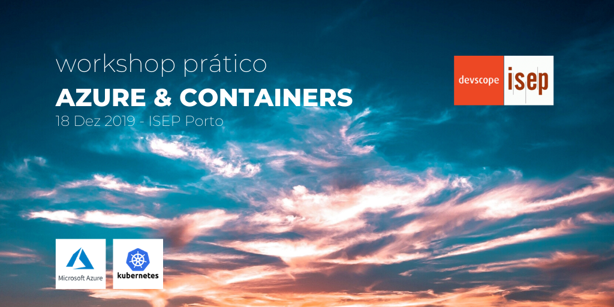

# __Workshop Azure & Containers @ ISEP__

--- 

## __Agenda (Azure Dev Spaces)__

1. Create a __Kubernetes-based__ environment in Azure that is __optimized__ for development - a __dev space__.
    
2. __Iteratively__ develop code in containers using __VS Code__ and the __command line__.
    
3. __Productively__ develop and test __your code__ in a __team environment__.

## __The Illustrated Children's Guide to Kubernetes__

---

## __Visual Studio Code and .NET Core with Azure Dev Spaces__

### __Initial CLI Setup__
Start by [installing the Azure CLI](https://docs.microsoft.com/en-us/cli/azure/install-azure-cli?view=azure-cli-latest) and verify installation.

__Login__ to your __Azure account__.

`az login`

If you have more than one subscription in your account, you can list them with the following command.

`az account list --output table`

If the subscription you desire has **_False_** value for **_IsDefault_** key.

`az account set --subscription <SUBSCRIPTION_ID>`

### __Create a Kubernetes cluster enabled for Azure Dev Spaces__

Create a __resource group__ for your __Kubernetes cluster__ in a [supported region](https://docs.microsoft.com/en-us/azure/dev-spaces/about#supported-regions-and-configurations)

`az group create --name "workshop-isep" --location "West Europe"`

Create an __Azure Kubernetes Service (AKS)__ 

`az aks create -g workshop-isep -n aks-workshop-isep --location "West Europe" --disable-rbac --generate-ssh-keys`

### __Configure your Kubernetes Cluster to use Azure Dev Spaces__

Enter the following command to __enable Azure Dev Spaces__ support in your cluster.

`az aks use-dev-spaces -g workshop-isep -n aks-workshop-isep`

### __Get Kubernetes Debugging for Visual Studio Code__

1. Install [Visual Studio Code](https://code.visualstudio.com/).

2. Install [Azure Dev Spaces extension](https://marketplace.visualstudio.com/items?itemName=azuredevspaces.azds).

### __Clone the Sample App__

__Clone__ the repository with the __.NET Core__ sample application to __deploy__ to __Azure Dev Spaces__.

This __repository__ is __forked__ from the __Azure Dev Space samples__ repository, it has been __restructured to ease the deployment__ process.

`git clone https://github.com/2morales/aks-workshop-isep.git`

### __Prepare the deployment__

The next step is to containerize it by creating assets that define the app's container and Kubernetes deployment.

1. Launch Visual Studio Code and open the project folder (ignore default prompts to add debug assets or restore the project dependencies).
2. Open the Terminal (View > Integrated Terminal).
3. Run the preparation command (be sure to change directory into the dotnetcore/webfrontend folder).

..1 `cd dotnetcore/webfrontend`

..2 `azds prep --public`

The following files will be generated:

* A __Dockerfile__ describing the app's container image, how the source code is built and runs within the container.
* A Helm chart under __./charts/webfrontend__ describing how to deploy the container to __Kubernetes__.
* A file named __azds.yaml__, containing the configuration file for Azure Dev Spaces. It complements Kubernetes artifacts with additional configuration that enables an iterative development experience in __Azure__.

It's worth pointing out, however, that the same Kubernetes and Docker configuration-as-code assets can be used from development through to production, thus providing better consistency across different environments.

---

## Azure Dev Spaces
AZDS is an Azure developer service that helps teams develop with speed on Kubernetes. [Click here for more information.](https://aka.ms/signup-azds)

## Purpose of this repository
This source repository primarily hosts *AZDS code samples* to support product guides, as well as provide high-level insight into our product roadmap. Product documentation is hosted here: http://aka.ms/get-azds.

## Contributing
This project welcomes contributions and suggestions.  Most contributions require you to agree to a
Contributor License Agreement (CLA) declaring that you have the right to, and actually do, grant us
the rights to use your contribution. For details, visit https://cla.microsoft.com.

When you submit a pull request, a CLA-bot will automatically determine whether you need to provide
a CLA and decorate the PR appropriately (e.g., label, comment). Simply follow the instructions
provided by the bot. You will only need to do this once across all repos using our CLA.

This project has adopted the [Microsoft Open Source Code of Conduct](https://opensource.microsoft.com/codeofconduct/).
For more information see the [Code of Conduct FAQ](https://opensource.microsoft.com/codeofconduct/faq/) or
contact [opencode@microsoft.com](mailto:opencode@microsoft.com) with any additional questions or comments.
