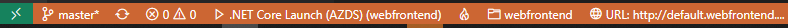

# __Workshop Azure & Containers @ ISEP__


--- 

## __Agenda (Azure Dev Spaces)__

1. Create a __Kubernetes-based__ environment in Azure that is __optimized__ for development - a __dev space__.
    
2. __Iteratively__ develop code in containers using __VS Code__ and the __command line__.
    
3. __Productively__ develop and test __your code__ in a __team environment__.

## __The Illustrated Children's Guide to Kubernetes__
[](https://youtu.be/4ht22ReBjno)

---

## [__Visual Studio Code and .NET Core with Azure Dev Spaces__](https://docs.microsoft.com/en-us/azure/dev-spaces/get-started-netcore)

### __Initial CLI Setup__
Start by [installing the Azure CLI](https://docs.microsoft.com/en-us/cli/azure/install-azure-cli?view=azure-cli-latest) and verify installation.

__Login__ to your __Azure account__.

`az login`

If you have more than one subscription in your account, you can list them with the following command.

`az account list --output table`

If the subscription you desire has **_False_** value for **_IsDefault_** key.

`az account set --subscription <SUBSCRIPTION_ID>`

### __Create a Kubernetes cluster enabled for Azure Dev Spaces__

Create a __resource group__ for your __Kubernetes cluster__ in a [supported region](https://docs.microsoft.com/en-us/azure/dev-spaces/about#supported-regions-and-configurations)

`az group create --name "workshop-isep" --location "West Europe"`

Create an __Azure Kubernetes Service (AKS)__ 

`az aks create -g workshop-isep -n aks-workshop-isep --location "West Europe" --disable-rbac --generate-ssh-keys`

### __Configure your Kubernetes Cluster to use Azure Dev Spaces__

Enter the following command to __enable Azure Dev Spaces__ support in your cluster.

`az aks use-dev-spaces -g workshop-isep -n aks-workshop-isep`

### __Get Kubernetes Debugging for Visual Studio Code__

1. Install [Visual Studio Code](https://code.visualstudio.com/).

2. Install [Azure Dev Spaces extension](https://marketplace.visualstudio.com/items?itemName=azuredevspaces.azds).

### __Clone the Sample App__

__Clone__ the repository with the __.NET Core__ sample application to __deploy__ to __Azure Dev Spaces__.

This __repository__ is __forked__ from the __Azure Dev Space samples__ repository, and it has been __restructured to ease the deployment__ process.

`git clone https://github.com/2morales/aks-workshop-isep.git`

### __Prepare the deployment__

The next step is to __containerize__ it by creating __assets__ that __define the app's container__ and __Kubernetes deployment__.

1. Launch Visual Studio Code and open the project folder (ignore default prompts to add debug assets or restore the project dependencies).
2. Open the Terminal (View > Integrated Terminal).
3. Run the __preparation__ command (be sure to change directory into the __dotnetcore/webfrontend__ folder).

   * `cd dotnetcore/webfrontend`

   * `azds prep --public`

The following files will be generated:

* A __Dockerfile__ describing the app's container image, how the source code is built and runs within the container.
* A Helm chart under __./charts/webfrontend__ describing how to deploy the container to __Kubernetes__.
* A file named __azds.yaml__, containing the configuration file for Azure Dev Spaces. It complements Kubernetes artifacts with additional configuration that enables an __iterative development__ experience in __Azure__.

It's worth pointing out, however, that the same __Kubernetes and Docker configuration-as-code assets__ can be used from __development through to production__, thus __providing better consistency__ across __different environments__.

Feel free to __explore the assets__ as you'll find __different options__ for configuration.

### __Build and run code in Kubernetes__

Run this command from the __root code folder__, dotnetcore/webfrontend:

`azds up`

Keep an eye on the command's output, as you'll notice several things:

* Source code is __synced__ to the __dev space__ in Azure. 
* A __container image__ is __built in Azure__, as __specified__ by the __Docker assets__ in your code folder.
* __Kubernetes objects__ are created that utilize the __container image__ as __specified__ by the __Helm chart__.
* Information about the __container's endpoint(s)__ is displayed.
* Assuming the above stages complete successfully, you should begin to __see stdout (and stderr)__ output as the container starts up.

These steps will __take longer the first time__ the up command is run, but subsequent runs should be quicker. 

### __Test the application__

Scan the console output for the **_Application started_** message.

```Python
Using dev space 'default' with target 'aks-workshop-isep'
Synchronizing files...2s
Installing Helm chart...6s
Waiting for container image build...4s
Building container image...
Step 1/13 : FROM mcr.microsoft.com/dotnet/core/sdk:2.2
Step 2/13 : ARG BUILD_CONFIGURATION=Debug
Step 3/13 : ENV ASPNETCORE_ENVIRONMENT=Development
Step 4/13 : ENV ASPNETCORE_URLS=http://+:80
Step 5/13 : ENV DOTNET_USE_POLLING_FILE_WATCHER=true
Step 6/13 : EXPOSE 80
Step 7/13 : WORKDIR /src
Step 8/13 : COPY ["webfrontend.csproj", "./"]
Step 9/13 : RUN dotnet restore "webfrontend.csproj"
Step 10/13 : COPY . .
Step 11/13 : RUN dotnet build --no-restore -c $BUILD_CONFIGURATION
Step 12/13 : RUN echo "exec dotnet run --no-build --no-launch-profile -c $BUILD_CONFIGURATION -- \"\$@\"" > /entrypoint.sh
Step 13/13 : ENTRYPOINT ["/bin/bash", "/entrypoint.sh"]
Built container image in 1m 49s
Waiting for container...28s
Service 'webfrontend' port 'http' is available at http://default.webfrontend.glbwwbn5sp.weu.azds.io/
Service 'webfrontend' port 80 (http) is available via port forwarding at http://localhost:50654
press Ctrl+C to detach
*
*
*
webfrontend-8556456767-7gmwd: Hosting environment: Development
webfrontend-8556456767-7gmwd: Content root path: /src
webfrontend-8556456767-7gmwd: Now listening on: http://[::]:80
webfrontend-8556456767-7gmwd: Application started. Press Ctrl+C to shut down.
```

Follow the public URL for the service, and notice how ___stdout___ and ___stderr___ output is streamed to the __azds trace terminal__. Tracking information for HTTP requests is also streamed, making it easier for you to track complex calls during development.

**Note** that the *http://localhost:PORT* is actually running in AKS. **Azure Dev Spaces** uses **port-forward** functionality to map the **localhost port** to the **container running in AKS**.

### **Update a content file**

**Azure Dev Spaces** isn't just about getting code running in Kubernetes - it's about **enabling you to quickly and iteratively see your code changes** take effect in a **Kubernetes environment in the cloud**.

1. Locate the file **./Views/Home/Index.cshtml** and make an edit to the HTML. For example, change **line 73** that reads `<h2>Application uses</h2>` to something like: `<h2>Hello ISEP! Welcome to Azure Dev Spaces!!!</h2>`
2. Save the file. Moments later, in the Terminal window you'll see a message saying a file in the **running container was updated**.
3. Refresh the page, and notice how the HTML content was updated.
   
Edits to content files, like **HTML and CSS**, **don't require recompilation** in a **.NET Core web app**, so an active `azds up` command **automatically syncs** any modified content files into the **running container in Azure**, so you can **see your content edits right away.**

### __Update a code file__

Updating code files **requires a little more work**, because a **.NET Core app needs to rebuild** and produce updated application binaries.

1. Stop `azds up` command.
2. Open the file **Controllers/HomeController.cs**, and edit the massage that the **About page** wil display.
3. Save the file.
4. Run `azds up` again.

This command **rebuilds the container image** and **redeploys the Helm chart**. To see your code changes take effect in the running application, go to the **About** menu in the web app.

## __Debug a Container in Kubernetes__
###

<p align="center">
  
</p>

### Initialize debug assets with the VS Code extension
You first need to __configure your code__ project so VS Code will communicate with our __dev space in Azure__. The VS Code __extension__ for __Azure Dev Spaces__ provides a helper command to __set up debug configuration__.

Open the __Command Palette__ (__using the View | Command Palette menu__), and use auto-complete to type and select this command: __Azure Dev Spaces: Prepare configuration files for Azure Dev Spaces__.

This __adds debug configuration__ for __Azure Dev Spaces__ under the __.vscode__ folder. This command is not to be confused with the azds prep command, which configures the project for deployment.

<p align="center"></p>

Select the __Azure Dev Spaces Debug Configuration__.

<p align="center"></p>

**Code** is then **synced to the dev space**, and a **container is built and deployed to Kubernetes**. This time, of course, the **debugger is attached** to the **remote container**.

The **VS Code status bar** indicates that the **debugger is attached**. It will also display a **clickable URL**, which you can use to **open your site**.

<p align="center"></p>

### __Edit code and refresh__

With the **debugger active**, make a code edit. For example, **modify** the About page's message in `Controllers/HomeController.cs`

```C#
public IActionResult About()
{
  ViewData["Message"] = "Hello ISEP! We are Debugging";
  
  return View();
}
```

Save the file, and in the **Debug actions pane**, click the **Refresh button**.

<p align="center"></p>

Instead of **rebuilding and redeploying** a new **container image each time code edits are made**, which will often **take considerable time**, **Azure Dev Spaces** will **incrementally recompile** code within the existing container to provide a **faster edit/debug loop**.

Refresh the web app in the browser, and go to the About page. You should see your custom message appear in the UI.

Now you have a method for **rapidly iterating** on code and **debugging directly in Kubernetes**! 

---

## __Troubleshooting__


### __Update Azure CLI__

`az aks use-dev-spaces -g <RESOURCE_GROUP_NAME> -n <AKS_CLUSTER_NAME> --update`

### __Could not find Azure Dev Spaces controller__

#### __If Azure Dev Spaces CLI is not installed:__

`az aks use-dev-spaces -g <RESOURCE_GROUP_NAME> -n <AKS_CLUSTER_NAME>`

#### __List Dev Spaces controllers in your selected subscription:__

`azds controller list`

#### __Select an Azure Dev Spaces controller:__

`azds controller select <CONTROLLER_NAME>`

#### __If the controllers list is empty:__

`azds controller create --name <CONTROLLER_NAME> --target-name <AKS_CLUSTER_NAME> --resourge-group <RESOURCE_GROUP_NAME>`

---

## __Azure Dev Spaces__
AZDS is an Azure developer service that helps teams develop with speed on Kubernetes. [Click here for more information.](https://aka.ms/signup-azds)

## __Purpose of this repository__
This source repository primarily hosts *AZDS code samples* to support product guides, as well as provide high-level insight into our product roadmap. Product documentation is hosted here: http://aka.ms/get-azds.

## __Contributing__
This project welcomes contributions and suggestions.  Most contributions require you to agree to a
Contributor License Agreement (CLA) declaring that you have the right to, and actually do, grant us
the rights to use your contribution. For details, visit https://cla.microsoft.com.

When you submit a pull request, a CLA-bot will automatically determine whether you need to provide
a CLA and decorate the PR appropriately (e.g., label, comment). Simply follow the instructions
provided by the bot. You will only need to do this once across all repos using our CLA.

This project has adopted the [Microsoft Open Source Code of Conduct](https://opensource.microsoft.com/codeofconduct/).
For more information see the [Code of Conduct FAQ](https://opensource.microsoft.com/codeofconduct/faq/) or
contact [opencode@microsoft.com](mailto:opencode@microsoft.com) with any additional questions or comments.
